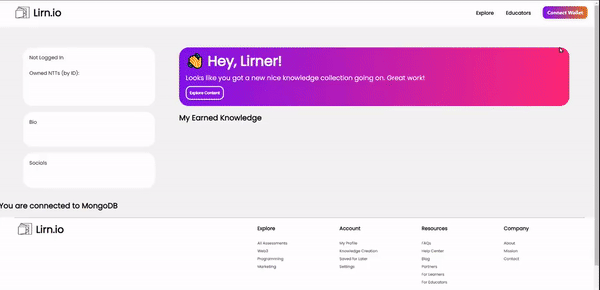

## Lirn.io Web Application MVP Beta
Pages:
- Home
- Explore
- Educators
- Profile




## Getting Started

Navigate to the folder of the web app

```bash
cd C:/directory to the folder on your computer here
```

Install the packages:

```bash
npm install
```

Run the development server:

```bash
npm run dev
```

Open [http://localhost:3000](http://localhost:3000) with your browser to see the web application.
